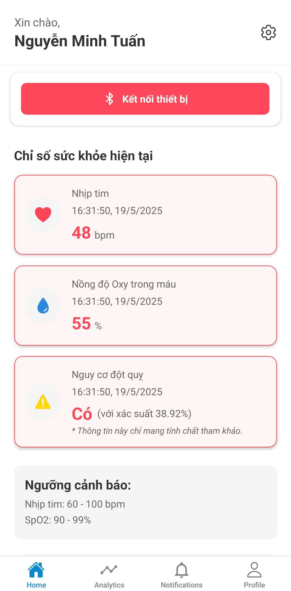
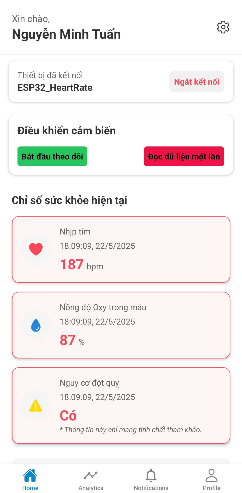
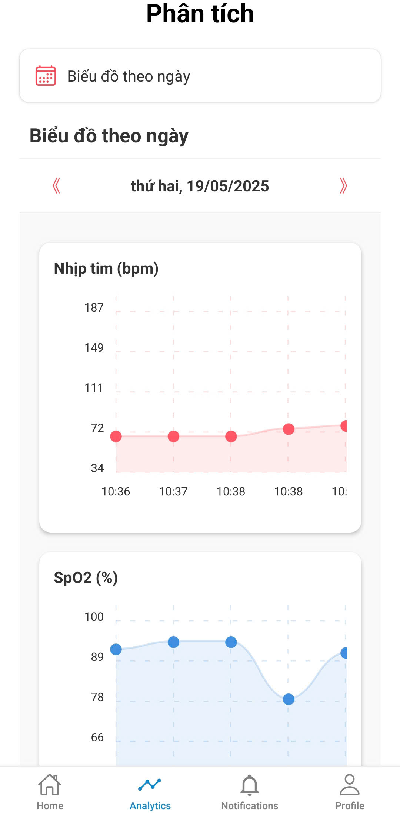
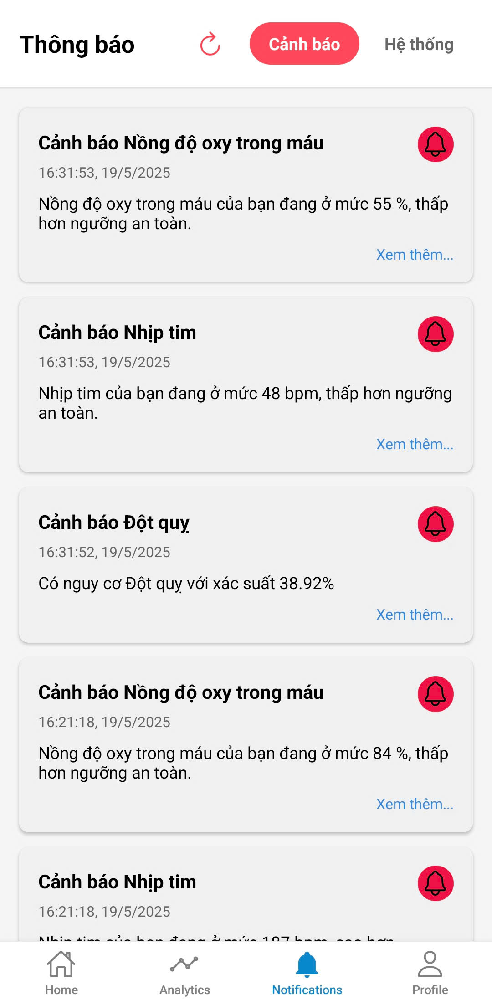
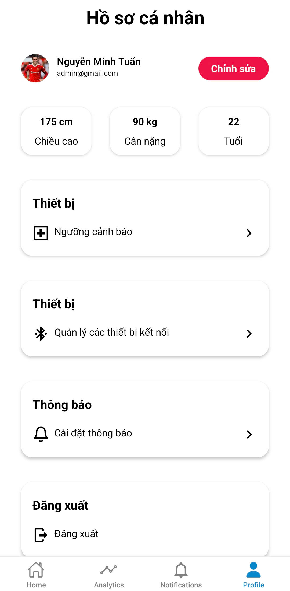

# AppHealth

## 1. Giới thiệu dự án

**AppHealth** là một hệ thống quản lý và theo dõi sức khỏe cá nhân, hỗ trợ người dùng ghi nhận, phân tích các chỉ số sức khỏe như nhịp tim, huyết áp, và nhận gửi email cảnh báo khi hệ thống phát hiện nguy cơ đột quỵ cao. Dự án hướng tới mục tiêu giúp người dùng chủ động theo dõi sức khỏe, phát hiện sớm các dấu hiệu bất thường và nâng cao chất lượng cuộc sống.

## 2. Các chức năng chính

- Đăng ký, đăng nhập tài khoản người dùng
- Quản lý hồ sơ cá nhân và thông tin sức khỏe
- Ghi nhận, lưu trữ và hiển thị các chỉ số sức khỏe (nhịp tim, huyết áp, v.v.)
- Lưu trữ dữ liệu sức khỏe
- Gửi nhắc nhở, cảnh báo người dùng, người thân
- Thống kê, biểu đồ trực quan hóa dữ liệu sức khỏe
- Tích hợp AI để chuẩn đoán nguy cơ đột quỵ tại thời điểm đo

## 3. Công nghệ sử dụng

- Front-end: Expo, React Native, TypeScript, NativeWind
- Back-end: Node.js, Express, Firebase (Firestore, Authentication, Functions, Storage)
- Database: Firebase Firestore
- AI: TensorFlow.js

### 4. Cấu trúc dự án

```
├── heart-rate-backend
│   ├── functions
│   ├── dataconnect
│   ├── dataconnect-generated
│   ├── .firebaserc
│   ├── firebase.json
│   ├── package.json
│   └── package-lock.json
├── front_end
│   ├── app
│   ├── assets
│   ├── config
│   ├── .env
│   ├── .eslintrc.json
│   ├── .gitignore
│   ├── .prettierrc.json
│   ├── babel.config.js
│   ├── metro.config.js
│   ├── package.json
│   ├── package-lock.json
│   ├── README.md
│   ├── tsconfig.json
│   └── app.json
├── back_end
│   ├── src
│   ├── .env
│   ├── .gitignore
│   ├── package.json
│   ├── package-lock.json
│   └── README.md
└── README.md
```

## 5. Hướng dẫn cài đặt

### 5.1. Cài đặt Front-end

Đầu tiên, hãy chạy câu lệnh

```bash
cd front_end
npm install
```

Sau đó, chạy câu lệnh

```
npx expo prebuild --platform android --clean
npx expo run:android
```

Cài file apk vừa build được vào điện thoại Android (máy ảo hoặc máy thật).<br>

Để chạy ứng dụng, chạy câu lệnh

```
npx expo start
```

- Yêu cầu: Node.js >= 14, npm >= 6

## 4. Ảnh demo dự án

| Màn hình           | Ảnh minh họa                                     |
| ------------------ | ------------------------------------------------ |
| Màn hình chính     |  |
| Chức năng đo       |   |
| Màn hình phân tích |          |
| Màn hình thông báo |   |
| Màn hình cài đặt   |             |

---
